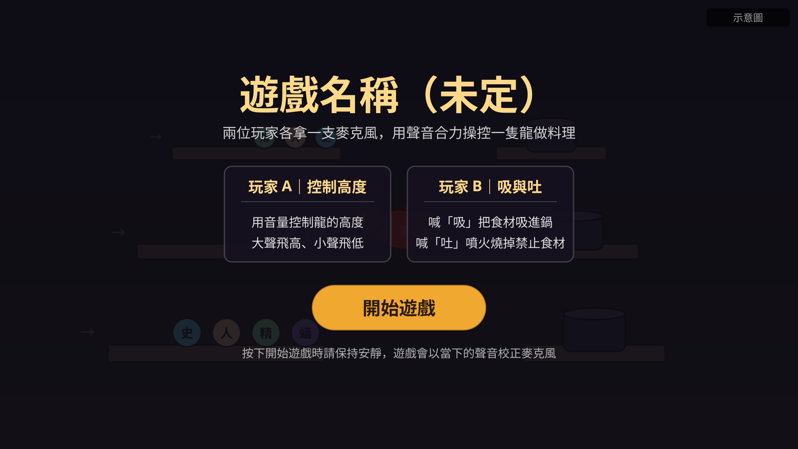
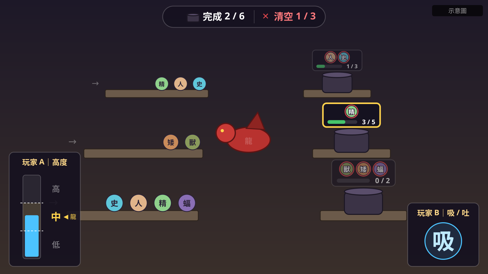
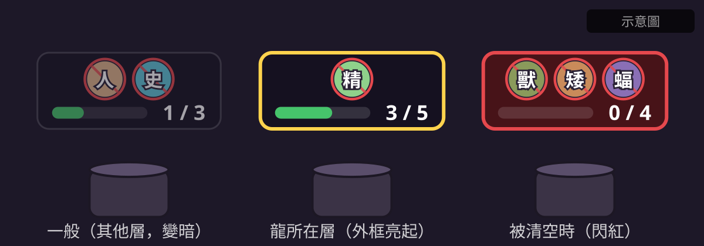
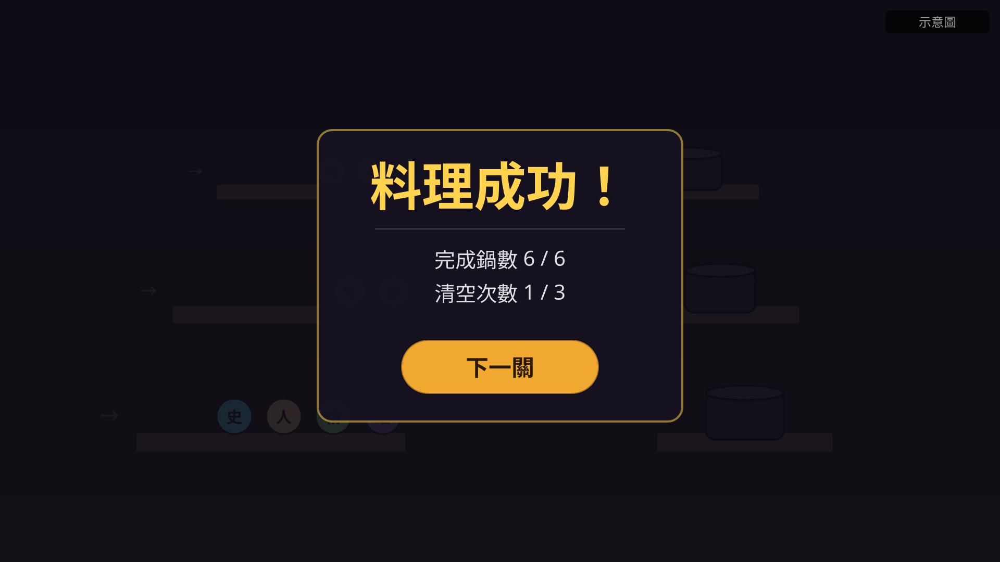
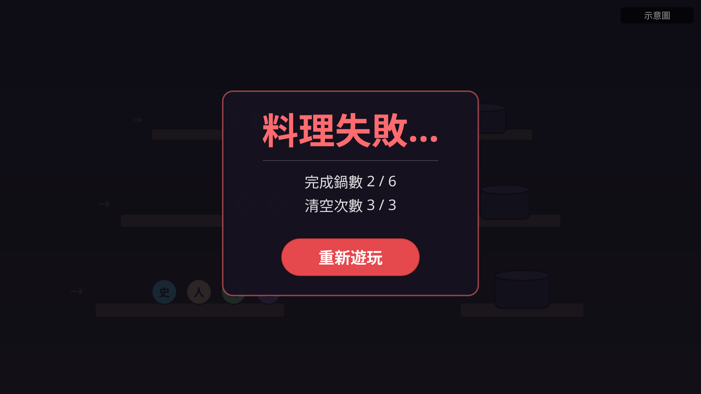

# 遊戲企劃書

> 本文件只寫已經確定的事。還沒決定的內容統一放在最後的「未定事項」，確定後再移到對應章節。

## 1. 遊戲概要

**一句話介紹：** 兩位玩家各用一台電腦、一支麥克風，透過區域網路連線，用聲音合力操控一隻龍，把排隊走來的奇幻種族吸進鍋裡做料理。
**一句話介紹：** 兩位玩家各拿一支麥克風，用聲音合力操控一隻龍，把排隊走來的奇幻種族吞下肚，再吐進鍋裡煮給小龍吃。

| 項目 | 內容 |
|---|---|
| 類型 | 3D 雙人合作、聲音操作 |
| 玩家人數 | 2 人，兩台電腦區域網路（LAN）連線 |
| 操作方式 | 每位玩家各用一支麥克風，主要以聲音操作；Client 電腦只負責傳送語音輸入封包（見 3.3） |
| 合作形式 | 非對稱合作：一人控制移動，一人控制動作 |
| 畫面表現 | 3D 模型呈現 |
| 時間限制 | 不限時間 |

## 2. 核心玩法循環

1. 每一層的食材從左邊排隊走向龍。
2. **玩家 A** 用音量大小，讓龍飛到想處理的那一層。
3. **玩家 B** 看該層最前面的食材：
   - 想要的食材：喊「吸」，吞進龍的胃袋（一次只能裝一個）。
   - 不要的食材：胃袋空著時喊「吐」，噴火燒掉，讓後面的食材遞補上來。
4. 龍帶著胃裡的食材飛到某一層，玩家 B 喊「吐」，把食材吐進那一層的鍋子。每個鍋子旁有一隻小龍，各自有不吃的食材（禁止清單）。
5. 鍋子收集到需求數量就完成一鍋，小龍吃飽離開、換下一隻。完成指定鍋數就獲勝；吐進禁止食材，小龍會踢翻鍋子，清空次數太多就失敗。

## 3. 操作設計

### 3.1 玩家 A：移動（音量）

用聲音大小決定龍停在哪一層。

| 玩家 A 的聲音 | 龍的位置 |
|---|---|
| 大聲 | 最高層 |
| 中音量 | 中間層 |
| 小聲 | 最低層 |
| 沒出聲 | 停在最後的高度，不會改變 |

- 龍只會上下移動，不會左右或前後移動。
- 遊戲開始時，以當下測到的音量作為校正基準。
- 層數和「音量對應哪一層」做成可調整的設定，增加層數時改設定即可。

### 3.2 玩家 B：吸與吐（字音辨識）

遊戲辨識玩家 B 發出的字音。

| 玩家 B 的字音 | 龍的動作 | 效果 |
|---|---|---|
| 「吸」 | 吞食 | 胃袋空著時，把該層最前面的食材吞進胃袋；胃袋已滿則沒有效果 |
| 「吐」（胃袋有食材） | 吐出 | 把胃裡的食材吐進該層的鍋子 |
| 「吐」（胃袋空著） | 噴火 | 燒掉該層最前面的食材 |

「吸」和「吐」都作用在龍所在的那一層；吞食和噴火的對象是隊伍最右邊（最靠近龍）的那一個食材。

- 食材必須已經走到隊伍最前端（最靠近龍的停止位置）才能被吸或吐，還在走路途中的食材不受影響。
- 指令沒有效果時（最前端沒有食材、胃袋已滿還喊「吸」），龍照樣做出動作，讓玩家知道指令有被收到。
- 龍的胃袋一次只能裝一個食材，可以帶著它飛到其他層再吐出來。
- 吐進鍋子是一喊就生效；噴火則要持續喊「吐」累計 1 秒（可調整）才會燒掉食材。
  - 燒的進度記在食材身上，食材上方顯示進度條。中途停下不會歸零，下次再對它噴火會接著累計。
  - 噴火途中龍換層，就改為燒新那一層最前面的食材。

### 3.3 雙機連線

- 兩台電腦在同一個區域網路內連線：一台是 **Host 電腦**，一台是 **Client 電腦**。
- Host 電腦執行遊戲邏輯並顯示遊戲畫面，是唯一的權威：食材、鍋子、龍的位置與勝敗都只在 Host 計算。
- Client 電腦只負責把語音輸入轉成封包傳給 Host，不執行遊戲邏輯。封包有兩種：
  - 音量（0～1 的數值，高頻率持續傳送，不保證每個都送達）
  - 字音（「吸」或「吐」，每個事件保證送達）
- Host 收到封包後會回覆確認；Client 超過 2 秒沒收到確認，會在畫面顯示錯誤。
- 連線方式：Host 建立房間並顯示本機 IP，Client 輸入該 IP 加入（port 7777，UDP）。
- 傳輸測試場景：`scenes/network_test/network_test.tscn`，已用兩台實機驗證封包可以雙向收發。

## 4. 場景與畫面

- 場景分成多層，目前做三層（高、中、低），之後可能增加。
- 各層垂直往上疊，層與層的間距可以調整。鏡頭從正面稍微往下看，最上面一層是高層，最下面一層是低層。
- 每一層左邊的平台放食材隊伍，右邊的平台放鍋子，龍在中間。
- 3D 場景最後面有一張 2D 龍洞穴背景圖（`scenes/backdrop/cave_backdrop.png`），自動對齊攝影機並蓋滿畫面，不影響 3D 房間。構圖：左邊上中下三層山洞隧道，中間是龍飛行的巨大山中洞穴，底部是龍巢與龍蛋，右邊是上中下三個料理洞窟。已換成正式美術（原檔名 `FGJ2026TeamE_GameSceneBG.png`）。
- 每一層由左到右依序是：**食材 → 龍 → 鍋子**。
- 龍在畫面中間，面向左邊的食材。
- 鏡頭：攝影機面向龍頭。

```
        食材隊伍（左平台）      龍      鍋子（右平台）
   →   [食材] [食材] [食材]            [鍋子]   高層
   →   [食材] [食材]          [龍]     [鍋子]   中層
   →   [食材] [食材] [食材]            [鍋子]   低層
                               ↑ 龍只在各層之間上下移動
```

### 4.1 龍的移動與所在層

- 龍以固定速度平滑移動到目標層，移動途中如果目標改變，就直接轉向新的目標。
- 每一層都有自己的範圍，以相鄰兩層之間的中線為界。龍目前的位置落在哪一層的範圍內，那一層就是龍的所在層；「吸」和「吐」都作用在所在層。

### 美術參考房間

- `scenes/dungeon_room/dungeon_room.tscn` 使用 dungeon 素材建立地牢房間，含石牆、地板、柱子、桌椅與煉金用品、木箱、火把、燭光與藥液光源。
- 原紅龍平台展示保留在 `scenes/main/dragon_platform_showcase.tscn`。

### Prototype 美術規格

- 每層左側實例化勇者挑戰房，右側實例化幼龍哺育房；哺育房仍保留玩法鍋子，中央保留龍的升降通道。
- 兩類房間各為可重用子場景，第一版依 `docs/dungeon_room_concept_v1.png` 與 `docs/dragon_nursery_concept_v1.png` 的石造建築與陳設方向製作。
- 朝攝影機的一面牆需開放，讓房間內部與主要陳設可見；通用封頂天花板為獨立子場景，且可獨立隱藏。
- 主場景構圖以使用者提供的 `docs/prototype_layout_reference.png` 紅龍與左右平台參考圖為準；平台沿高度排列。使用 Perspective 攝影機，換算 Blender 的 150mm、位置 `(0, -280, 40)` 與 XYZ 角度 `(85, 0, 0)`，不直接套用不同座標系的數值。
- 先交付必要美術子場景、布局與紅龍既有動畫接口；各關生成及玩法邏輯由程式接入。使用者會提供缺少的幼龍、龍蛋、巢穴與稻草／軟墊素材，到位前保留定位點；需求與進度由 `docs/art_asset_needs.md` 追蹤。
- 吸取、噴火的 shader 與粒子特效由技術美術與特效 session 負責，提供團隊可重用的子場景及程式接口。第一版吸取使用向龍嘴收束的氣流，噴火使用短錐形暖色火焰；表現保持清楚、節制，避免遮住食材與鍋子。動畫對應與玩法觸發時機另行定案。
- 使用者提供三種龍蛋 GLB，保存在 `Models/dragonEggs/`，作為哺育房陳設；各模型需分別確認尺寸與材質。
- 使用者提供幼龍 GLB 與三張貼圖，保存在 `Models/dragonBabies/`，由場景美術配置哺育房；本批模型未附動畫，先採靜態展示。
- 使用者新增 `Models/kitkayDungeon/` 地牢物件與人物素材批次；素材未分類，配置前必須確認實際模型內容、尺寸、原點、朝向及材質。
- 使用者指定兩類房間使用不同素材；kitkayDungeon 分配哪一類房間尚未決定，先盤點、暫不配置此批地牢物件。人物模型先放勇者挑戰房，待確認人物檔案位置及內容後實作。
- 使用者要求吸取／噴火特效加寬，預設採更誇張、覆蓋更大的範圍；兩效果提供分別可調的寬度接口及設定文件，寬度與射程分開控制。此處「吐」指噴火視覺，不包含胃袋吐食材的玩法實作。
- 使用者確認保留目前主場景的新構圖：RedDragon 根節點倍率為 5，位置約 `(0, 6.4, -16.019)`。此展示變換獨立於樓層 DragonAnchor，不還原為首版倍率 2 與原定位點。

## 5. 遊戲規則

### 5.1 食材

食材共 6 種：**人類、精靈、矮人、史萊姆、獸人、蝙蝠**。

- 場上只有食材，沒有障礙物或敵人。
- 所有食材的移動速度相同，在隊伍中以固定間隔排列。
- 食材不用先烤，直接吸就可以。

### 5.2 食材隊伍

- 每一層的食材從畫面左側外面出現，往右移動排隊，走到最右邊就停下來等待。
- 每一層最多累積設定數量的食材（預設 5 個），累積滿了就停止產生新食材。
- 新食材在「數量低於上限」而且「隊伍最後一個食材已離開出生點至少一個間隔距離」時才產生，所以食材會一個接一個、間隔整齊地走進來，不會重疊。
- 遊戲開始時，每一層直接排滿上限數量的食材，玩家第一秒就能操作。
- 最右邊的食材被吸走或燒掉後，後面的食材往右遞補，並檢查該層食材數量；低於上限就產生新食材。

### 5.3 鍋子

- 每一層的右邊各有一個鍋子，鍋子旁有一隻小龍。
- 小龍的要求只有禁止清單和需求數量：列出 1～3 種不吃的食材（例如「不吃人類、史萊姆」），並要收集 2～5 個食材才算完成。禁止清單以外的食材都可以放。
- 小龍的要求在牠出現時隨機產生。
- 食材吐進鍋子時檢查是否為禁止食材：
  - 不是禁止食材：鍋子數量 +1，達到需求數量就完成一鍋，小龍吃飽離開，換一隻新的小龍過來。
  - 是禁止食材：小龍踢翻鍋子，鍋子清空，算一次清空；這隻小龍離開，換一隻新的小龍過來。
- 換小龍需要一段時間（舊的離開、新的走來）。新的小龍到位之前，這一層的鍋子不能吐入食材：喊「吐」沒有效果，食材留在胃袋裡。胃袋空著時喊「吐」仍會噴火，不受影響。
- 介面要顯示每一鍋的禁止清單與進度（由 UI 決定呈現方式），遊戲機制提供查詢與通知的接口。

### 5.4 勝敗條件

| 結果 | 條件 |
|---|---|
| 成功 | 累積完成的鍋數達到指定數量 |
| 失敗 | 鍋子被清空的次數達到指定數量 |

## 6. 介面與流程

### 6.1 遊戲流程

```
開啟遊戲 → 主選單 →（進入遊戲）→ 房間等候頁 →（以單機遊玩，載入遊戲並立即校正聲音）→ 遊玩 ─┬→ 成功 ─┬→ 下一關（還有下一關時）
                                                                                     │       └→ 回主選單（最後一關）
                                                                                     └→ 失敗 ──→ 重新遊玩
```

1. 開啟遊戲後先顯示主選單（獨立場景 `scenes/main_menu/main_menu.tscn`），有「進入遊戲」「離開」兩顆按鍵。
2. 「進入遊戲」在區網自動開房並進入房間等候頁，從等候頁選擇單機、加入他人或開始連線局（流程見 [lobby-flow.md](lobby-flow.md)）。
3. 遊戲場景載入完成的當下以當時測到的音量校正聲音並開始遊玩。校正不需要專門的介面。
   - 「重新遊玩」在同一個場景內原地重置隊伍、鍋子、胃袋與計數後直接開始，不回到主選單。
4. 遊玩到成功或失敗其中一個條件達成為止（條件見 5.4），顯示遊戲結束介面。連線局結束時改顯示「回到房間」（NetworkGameBridge）。
5. 場景切換由 autoload `RoomManager` 負責，各畫面只呼叫它。

### 6.2 介面架構

- 主選單是獨立場景；遊玩狀態與遊戲結束介面在遊戲場景內運作。
- 每個介面是一個獨立的介面元件，元件內包含該介面要顯示的內容。
- 依照遊戲狀態開關各介面元件，並更新顯示內容。

| 遊戲狀態 | 顯示的介面元件 |
|---|---|
| 遊玩中 | 遊玩狀態介面 |
| 結束（成功 / 失敗） | 遊戲結束介面 |

### 6.3 介面元件總覽

所有介面元件都放在同一個 UI 根節點底下，畫在 3D 遊戲畫面上方。介面以 1920×1080（16:9）為基準設計。

各介面的示意圖放在 `docs/images/`，只表示元件的位置與資訊，不代表最終美術。

```
UIRoot (CanvasLayer)          UI 根節點，負責依遊戲狀態開關底下的介面元件
├── PlayHud (Control)         遊玩狀態介面
│   └── PotInfo ×層數         每一層鍋子的資訊（依層數產生）
└── ResultScreen (Control)    遊戲結束介面
```

| 介面元件 | 場景檔 | 顯示時機 |
|---|---|---|
| UI 根節點 | `scenes/ui/ui_root.tscn` | 一直存在 |
| 主選單（獨立場景，不在 UIRoot 底下） | `scenes/main_menu/main_menu.tscn` | 開啟遊戲時、結果畫面按「回主選單」後 |
| 遊玩狀態介面 | `scenes/ui/play_hud.tscn` | 遊玩中 |
| 鍋子資訊 | `scenes/ui/pot_info.tscn` | 遊玩中，每一層一個 |
| 遊戲結束介面 | `scenes/ui/result_screen.tscn` | 成功或失敗時 |

UIRoot 同一時間只會顯示一個主要介面（遊玩、結束二選一）。

### 6.4 主選單（MainMenu）



**功用：** 開啟遊戲後第一個看到的獨立場景。讓玩家知道怎麼玩，按下「進入遊戲」後進入房間等候頁。

**介面長相：**
- 背景是遊戲 Logo 圖（`scenes/ui/game_logo.png`，戴廚師帽的紅龍與「龍席 Dragon Feast」標題），鋪滿整個畫面，保持原圖亮度。遊戲名稱由 Logo 呈現，不另外放文字標題。
- 畫面左右兩側的岩壁上各一張說明卡，避開中央的龍與標題：
  - 左卡「玩家 A｜控制高度」：用音量控制龍的高度，大聲飛高、小聲飛低。
  - 右卡「玩家 B｜吸與吐」：喊「吸」把食材吞進胃袋，喊「吐」吐進鍋子，胃空時噴火。
- 畫面底部正中是一顆大的「進入遊戲」按鍵，右邊一顆較小的「離開」；上方一行提示文字顯示 `RoomManager.notice`（例如對方關閉房間），沒有提示時隱藏。
- 按鍵正下方一行提示文字：「開始遊戲時請保持安靜，遊戲會以當下的聲音校正麥克風」。
- 畫面底部加一層由透明漸深的陰影，讓按鍵與提示文字在火焰背景上看得清楚。
- 上方示意圖是加入 Logo 之前的版本，實際畫面以本段描述為準。

**元件內容：**

| 元件 | 節點類型 | 內容 / 功用 |
|---|---|---|
| Background | TextureRect | 遊戲 Logo 背景圖，等比例鋪滿畫面（超出部分裁切） |
| BottomShade | TextureRect | 底部漸層陰影 |
| PlayerACard | PanelContainer | 玩家 A 的操作說明，畫面左側 |
| PlayerBCard | PanelContainer | 玩家 B 的操作說明，畫面右側 |
| StartButton | Button | 「進入遊戲」。呼叫 `RoomManager.enter_room()`，自動開房並進入等候頁 |
| QuitButton | Button | 「離開」。關閉遊戲 |
| NoticeLabel | Label | `RoomManager.notice` 的提示文字 |
| CalibrationHint | Label | 提醒玩家按下時保持安靜 |

### 6.5 遊玩狀態介面（PlayHud）



**功用：** 遊玩時顯示的資訊，讓兩位玩家知道每一鍋能放什麼、進度到哪裡、離成功或失敗還有多遠，以及自己的聲音被遊戲判定成什麼。

**介面長相：**
- 不蓋底色，3D 遊戲畫面完整露出，資訊放在畫面邊緣和鍋子旁邊，避免擋住食材隊伍和龍。
- **畫面上方正中**：一條橫向資訊列。
  - 左半邊是完成鍋數，鍋子圖示加上「完成 2 / 6」。
  - 右半邊是清空次數，用紅色顯示「清空 1 / 3」（兩塊各是一條石框，左邊配獎盃圖示、右邊配骷髏圖示，見 6.9）。清空次數只差 1 次就失敗時，文字持續閃爍。
- **每一層鍋子旁邊**：一塊小面板，跟著該層鍋子在畫面上的位置（見 6.6）。
- **畫面左下角**：玩家 A 面板。
  - 標題「玩家 A｜高度」。
  - 一根直立的音量條，即時顯示玩家 A 目前的音量。
  - 音量條上畫出各層的門檻線，每一段旁邊標上「高」「中」「低」。
  - 龍目前所在的那一段會亮起。
- **畫面右下角**：玩家 B 面板。
  - 標題「玩家 B｜吸 / 吐」。
  - 中間用大字顯示最後辨識到的字音「吸」或「吐」，剛辨識到時放大並閃一下，之後變淡。

**元件內容：**

| 元件 | 節點類型 | 內容 / 功用 |
|---|---|---|
| TopBar | HBoxContainer | 上方資訊列 |
| CompletedLabel | Label | 完成鍋數 / 成功需要的鍋數 |
| ClearedLabel | Label | 清空次數 / 失敗需要的次數 |
| PotInfoContainer | Control | 放置各層的鍋子資訊，依層數產生 PotInfo |
| PlayerAPanel | PanelContainer | 玩家 A 面板 |
| VolumeBar | ProgressBar（直立） | 玩家 A 目前音量 |
| ThresholdLines | Control | 依各層門檻在音量條上畫線並標示層名 |
| PlayerBPanel | PanelContainer | 玩家 B 面板 |
| WordLabel | Label | 最後辨識到的字音「吸」或「吐」 |
| CountdownPanel | PanelContainer | 倒數計時「剩餘時間 0:59」，在上方資訊列下方。**僅測試用**：正式遊戲不限時間，預設隱藏 |

**需要的資料：**

| 資料 | 來源 |
|---|---|
| 完成鍋數、清空次數、成功與失敗需要的數量 | 遊戲機制 |
| 各層鍋子的禁止食材、已收集數量、需求數量 | 遊戲機制 |
| 玩家 A 目前音量、各層門檻 | 麥克風輸入 |
| 龍目前所在的層 | 遊戲機制 |
| 玩家 B 辨識到的字音 | 麥克風輸入 |

### 6.6 鍋子資訊（PotInfo）



**功用：** 顯示單一層鍋子的禁止食材與進度，讓玩家 B 判斷該層最前面的食材要「吸」還是「吐」。

**介面長相：**
- 一塊小的石框面板（一般層是灰色石框，龍所在的層換成橘金色石框），位置跟著該層鍋子，顯示在鍋子上方。
- 上排是禁止食材：1～3 個食材圖示並排，每個圖示上蓋一個紅色禁止符號（圓圈加斜線）。
- 下排是進度：一條短的橫向進度條，旁邊寫「3 / 5」。
- 龍所在的那一層，面板外框會亮起，其他層的面板稍微變暗。
- 該鍋完成時，面板閃綠色；該鍋被清空時，面板閃紅色並輕微晃動。

**元件內容：**

| 元件 | 節點類型 | 內容 / 功用 |
|---|---|---|
| Panel | PanelContainer | 面板底與外框 |
| ForbiddenIcons | HBoxContainer | 放 1～3 個禁止食材圖示 |
| ForbiddenIcon ×1～3 | TextureRect | 食材圖示加禁止符號 |
| ProgressBar | ProgressBar | 已收集數量 / 需求數量 |
| ProgressLabel | Label | 「3 / 5」 |

### 6.7 遊戲結束介面（ResultScreen）

| 成功 | 失敗 |
|---|---|
|  |  |

**功用：** 遊戲成功或失敗時顯示結果，並提供下一步的選項。成功和失敗共用這個介面，依結果切換內容。

**介面長相：**
- 背景是遊戲結束背景圖（`scenes/ui/result_background.png`）：與 Logo 同一個山洞，模糊、調暗並偏暖紅，遊玩狀態介面隱藏。
- 面板上方是橫幅：成功是「VICTORY」字樣、兩側月桂葉；失敗是「DEFEAT」字樣、兩側牛角骷髏。介面出現時橫幅彈出。
- 畫面正中是一塊大面板，外觀是金角石框（九宮格拉伸），面板頂端是木製標題牌，牌上寫「料理成功！」或「料理失敗…」。失敗時面板偏紅。
- 結算以圖示呈現：獎盃配「完成鍋數」，骷髏配「清空次數」。按鍵成功是金色框按鍵，失敗是紅色按鍵。
  - 最上方大字標題：成功時是金色的「料理成功！」，失敗時是紅色的「料理失敗…」。
  - 標題下方兩行結算：「完成鍋數 2 / 6」、「清空次數 3 / 3」。
  - 最下方是一顆大按鍵，文字依情況不同（見下表）。

| 情況 | 標題 | 按鍵 | 按下後 |
|---|---|---|---|
| 成功，還有下一關 | 料理成功！ | 下一關 | 載入下一關的設定，開始遊玩 |
| 成功，已經是最後一關 | 料理成功！ | 回主選單 | 回到主選單 |
| 失敗 | 料理失敗… | 重新遊玩 | 以同一關的設定重新開始遊玩 |

**元件內容：**

| 元件 | 節點類型 | 內容 / 功用 |
|---|---|---|
| Background | TextureRect | 遊戲結束背景圖，等比例鋪滿畫面 |
| Banner | HBoxContainer | 上方橫幅：BannerText（VICTORY／DEFEAT 字樣圖）、DecoLeft／DecoRight（月桂葉或骷髏） |
| ResultPanel | PanelContainer | 中央面板，金角石框（StyleBoxTexture 九宮格） |
| TitlePlate | PanelContainer | 木製標題牌，放 ResultLabel |
| CompletedStat／ClearedStat | Label | 完成鍋數、清空次數，各配獎盃、骷髏圖示 |
| ResultLabel | Label | 「料理成功！」或「料理失敗…」 |
| StatsLabel | Label | 完成鍋數與清空次數 |
| ActionButton | Button | 依情況顯示「下一關」「回主選單」或「重新遊玩」 |

### 6.8 介面與遊戲的對接

介面只負責顯示，資料來自遊戲機制（`GameManager`、`Dragon`，接口見 `docs/api.md`）與麥克風輸入（`MicInput`，見 `docs/voice-input.md`）。對接由 `scenes/ui/game_ui.tscn`（腳本 `ui_game_bridge.gd`）負責，已實例化在 `game.tscn`（`GameManager` 的子節點 `GameUI`），執行 `game.tscn` 就會先顯示遊戲開始介面。「開始遊戲」按鍵與鍵盤 Enter 都呼叫 `start_game()`，效果相同。

| 介面顯示 | 資料來源 |
|---|---|
| 完成鍋數 | `completed_count_changed`、`pots_to_win` |
| 清空次數 | `cleared_count_changed`、`clears_to_lose` |
| 各層禁止食材與進度 | `baby_arrived`、`pot_changed` 後讀 `get_pot(lane)` 的 `forbidden`、`count`、`required` |
| 鍋子完成（閃綠色）／被踢翻（閃紅色） | `baby_left(lane, reason)`，`reason` 為 `COMPLETED` 或 `KICKED` |
| 龍所在的層 | `Dragon.current_lane_changed` |
| 玩家 A 音量條 | 每幀讀 `MicInput.volume_value`（0～100），門檻線依層數平均分段 |
| 玩家 B「吸」 | `ingredient_swallowed`、`suck_missed` |
| 玩家 B「吐」 | `ingredient_spat`、`spit_missed`，以及開始噴火（`is_spitting` 變成 true） |
| 開始遊戲 | `game_started` 時顯示遊玩狀態介面；從開始介面進入時呼叫麥克風校正（`MicInput.calibrate()`，完成前略過），重新遊玩不重新校正 |
| 遊戲結束 | `game_won`／`game_lost` 顯示遊戲結束介面；「重新遊玩」呼叫 `start_game()`。「下一關」等關卡資料完成才提供，目前成功時顯示「關閉遊戲」 |

玩家 B 的「吸」「吐」以遊戲收到的指令為準，所以鍵盤測試（J 吸、按住 K 吐）與麥克風都會顯示。

### 6.9 介面美術風格

介面美術使用 UI 素材包 `scenes/ui/UI/`（Game GUI Kit「The Stone」：石材、木頭與金邊的奇幻風格），配合龍穴與地牢主題。共用主題 `scenes/ui/ui_theme.tres` 統一字型與按鍵樣式，遊玩狀態介面與遊戲結束介面都套用。

| 用途 | 素材 |
|---|---|
| 字型 | `Fonts/Changa-Bold.ttf`（英文、數字），中文自動改用系統粗體字型；文字一律加深色描邊 |
| 一般按鍵 | `Button/Button_Square02_n`（滑過與按下用 `_f`） |
| 失敗按鍵 | `Button/Button01_Red` |
| 上方數值條、倒數計時 | `UI_Etc/ResourceBar_Bg01`，圖示 `Icon_ItemIcon_Trophy`、`Icon_ItemIcon_Skull`、`Icon_ItemIcon_Timer` |
| 玩家 A／B 面板 | `Popup/Popup_Bg` |
| 玩家 B 字音外圈 | `Frame/ProfileFrame_199_Border` |
| 音量條底 | `UI_Etc/InputField_Bg_Demo_Normal`（填色為橘金色） |
| 鍋子資訊 | `Frame/StageFrame_Demo_n`（一般）、`StageFrame_Demo_f`（龍所在層）；進度條 `Slider/Slider_Basic02_Bg_Demo`、`Slider_Basic02_Fill_Orange` |
| 禁止符號 | `Icon_PictoIcon_Block`（染成紅色） |
| 遊戲結束面板 | `Frame/PanelFrame02_Demo`、標題牌 `Popup/Popup_Title_Center`（兩側 `Popup_Title_DecoLeft`／`DecoRight`） |
| 遊戲結束橫幅 | `ActionText/ActionText_Victory`／`ActionText_Defeat`，裝飾 `Image_Deco_Laurel_L／R`、`Image_DefeatScene_Skull2／3` |

路徑都在 `scenes/ui/UI/Sprites/Components/` 或 `scenes/ui/UI/Sprites/Demo/Demo_Image/` 底下。主選單（露柑負責）尚未套用這套風格。

## 7. 關卡設定參數

以下所有參數集中在一個關卡設定檔，**每一關可以設定不同的數值**，方便調整平衡，不寫死在程式碼裡。

| 參數（每關各自設定） | 預設值 / 範圍 |
|---|---|
| 層數 | 3 |
| 音量分段對應的層 | 大聲 → 高、中音量 → 中、小聲 → 低 |
| 每層食材上限 | 5 |
| 每鍋禁止食材數 | 1～3 種 |
| 每鍋需求食材數 | 2～5 個 |
| 成功需要的完成鍋數 | 預設 6 鍋 |
| 失敗需要的清空次數 | 預設 3 次 |
| 層與層的間距 | 可調整，預設值未定 |
| 食材移動速度、間隔距離 | 未定 |
| 換小龍的時間 | 未定 |

---

## 未定事項

### 玩法
- 各種食材除了種類之外是否有差異（出現在哪幾層、出現機率）
- 關卡數量，以及各關的數值

### 聲音操作
- 校正測的是環境噪音，還是玩家 A 說一句話；三段音量的門檻怎麼從校正值算出來
- 玩家 B 的麥克風是否也要校正
- 音量要維持多久才算換層（避免聲音漸強或收尾時經過中間音量，造成龍誤換層）
- 「吸」「吐」字音辨識的做法（語音辨識套件 / 自行分析聲音特徵）
- 兩支麥克風收音互相干擾怎麼處理
- 麥克風以外的輔助操作要用什麼、負責哪些事（例如選單、暫停）

### 畫面與美術
- 龍的朝向（面向鏡頭，或面向左邊的食材）
- 美術風格（低多邊形 / 寫實 / 卡通），模型自製還是使用免費素材
- 吞食、吐進鍋子、噴火、小龍踢翻鍋子與換小龍的動畫表現
- 遊戲名稱
- UI 美術素材：食材圖示、禁止符號、按鍵樣式、字型
- 遊戲結束背景、資訊面板的正式版（目前是暫時版，提示詞見 `docs/ui_art_prompts.md`）
- 進入下一關或重新遊玩時，是否要重新校正聲音

### 技術與範圍
- 玩家 A（音量）與玩家 B（吸／吐）各自對應 Host 還是 Client 電腦；Host 電腦自己的麥克風是否也要參與
- Client 沒有遊戲畫面時，是否也要顯示簡易畫面（例如目前層、鍋子狀態）
- 目標平台（Windows / Web），依效能測試與雙麥克風測試結果決定
- 範圍（必做 / 有時間再做）
