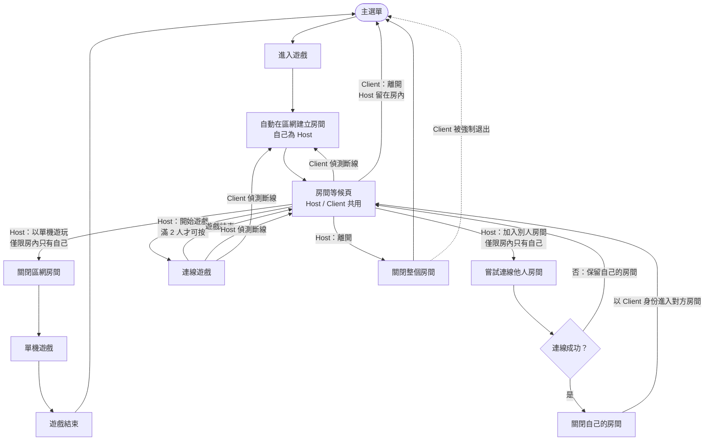

# Team E 單機 / 雙機連線流程

Faust Game Jam 2026 · 主題 Breath

進入遊戲即在區網自動開房，從房間等候頁決定單機、加入他人或等人開局。Host（房主）與 Client（加入者）共用同一個等候頁，箭頭上標示誰能操作。

## 流程圖

## 流程規則

1. 進入遊戲時自動在區網建立房間，自己為 Host，進入房間等候頁。
2. **以單機遊玩**：關閉區網房間，開始單機遊戲；結束後回主選單。
3. **加入別人房間**：嘗試連線他人房間。
   - 成功：關閉自己的房間，以 Client 身份進入對方房間（顯示同一個等候頁）。
   - 失敗：保留自己的房間，留在原等候頁。
4. **開始遊戲**：滿 2 人時 Host 可按開始，進入連線遊戲；結束後回到同一個等候頁，方便繼續下一局。
5. **斷線**：回到房間等候頁。
6. **離開**：
   - Host 離開：關閉整個房間，Client 被強制退出回主選單，Host 也回主選單。
   - Client 離開：回主選單，Host 留在房內。

## 等候頁按鈕

| 按鈕 | Host | Client |
|---|---|---|
| 以單機遊玩 | 房內只有自己時可按 | 不顯示 |
| 加入別人房間 | 房內只有自己時可按 | 不顯示 |
| 開始遊戲 | 滿 2 人才可按 | 顯示「等待房主開始」 |
| 離開 | 關閉房間，Client 一起退回主選單 | 自己回主選單，Host 留在房內 |

## 已確認

- **Client 斷線後去哪**：原房間屬於對方，已連不上，重新建立自己的房間。
- **加入失敗的原因**：房間已滿、對方遊戲中，都當作連線失敗，退回自己房間並顯示原因。
- **找房方式**：手動輸入 IP。
- **連線逾時**：「嘗試連線」上限 20 秒。

兩天 jam 建議優先順序：按鈕限制、Client 的等候提示，其次才是逾時。

## 實作對應

- `autoload/room_manager.gd`（`RoomManager`）：狀態機與換場景。等候頁、遊戲、主選單都只呼叫它，不自己換場景。
- `autoload/network_manager.gd`（`NetworkManager`）：連線、20 秒逾時、拒絕原因、關房通知、開始／結束連線局、斷線判定（約 6 秒）。
- `scenes/lobby/room_lobby.tscn`：Host／Client 共用等候頁，可單獨 F6 執行。
- `scenes/main_menu/main_menu.tscn`：主選單（「進入遊戲」呼叫 `RoomManager.enter_room()`、「離開」關閉遊戲）。原暫用主選單 `temp_menu.tscn` 已由它取代。
- `scenes/game/client_play.tscn`：Client 連線局畫面，依座位回報輸入：坐玩家 1 時把音高與層傳給 Host（`PlayerPitchInput`），坐玩家 2 時把吸／吐（麥克風或 J／K）傳給 Host（`PlayerActionInput`）。
- `scenes/game/network_game_bridge.gd`（`NetworkGameBridge`，遊戲場景 `scenes/game/main.tscn` 尾端的節點）：只在 Host 的連線局啟用，依座位（`RoomManager.host_slot`）決定輸入來源。房主坐玩家 1：房主用本機音高換層（保留 1／2／3 鍵當保底），停用本機 J／K 與語音吸吐，吸吐來自 Client（`inhale` 呼叫 `suck()`、`exhale` 開始噴火／吐、`none` 放開）。房主坐玩家 2：房主用本機 J／K 與語音吸吐，停用本機音高與數字鍵換層，換層來自 Client 傳來的 `lane`（`NetworkManager.pitch_received`），音高比例也餵給 HUD 的音高條。兩種座位都直接開局、結束時顯示臨時的「回到房間」（UI-15 完成後可拿掉）。單機與直接 F6 執行遊戲場景時不做任何事。
- 「嘗試連線」期間會先關掉自己的房間（ENet 一次只能是 Server 或 Client），失敗後重新建立，效果等同流程圖的「保留自己的房間」。
- 遊戲端要回到房間時呼叫 `RoomManager.finish_match()`（Host）；單機結束呼叫 `RoomManager.return_to_menu()`。
- 暫停（`PauseMenu`，Esc）：Host 在遊戲中會凍結遊戲並以 `NetworkManager.send_pause_state()` 通知 Client（Client 顯示「房主已暫停」）；暫停中 `NetworkGameBridge` 只記下 Client 的動作，繼續時再接上噴火。Client、等候頁、連線中的 Esc 只疊出麥克風設定，不凍結（`RoomManager.pause_freezes_game()`）。`RoomManager` 換場景前一律解除暫停。
- 等候頁的玩家輸入顯示（`player_input_panels.tscn`，樣式沿用遊玩介面）：左下玩家 1（音高條，低／中／高）、右下玩家 2（吸／吐大字）。坐在某個座位的人，本機量該座位的輸入並傳給對方：玩家 1 用 `PlayerPitchInput` 以 `NetworkManager.send_pitch()` 傳音高與層（層改變時立刻送，平時每秒約 15 次），玩家 2 用 `PlayerActionInput` 以 `send_voice_action()` 傳吸／吐；另一個座位顯示對方傳來的輸入。等候頁嚴格依座位偵測：坐玩家 1 只處理並顯示音高，坐玩家 2 只處理並顯示吸／吐，房內只有自己時也一樣，另一個座位等對方加入。單機遊戲開始後兩種輸入都由自己操作，可以在 Esc 選單與遊戲畫面確認。「我負責的」那一塊多一個語音開關。層的換算與遊戲內相同（`PitchLaneInput.pick_lane`）。

## 座位（玩家 1／玩家 2）

- 玩家 1 用音高控制龍的高度，玩家 2 負責吸／吐。誰坐哪個座位與誰是房主無關，遊戲邏輯仍然只在房主的電腦上執行。
- 在等候頁點選「玩家 1」「玩家 2」切換自己的角色，**不需要對方同意，也不需要重新準備**：
  - 房內只有自己時，點哪個座位就坐哪個，對方加入後坐另一個。
  - 房內有兩人時，點對方的座位就兩人互換。Client 的要求（`NetworkManager.request_slot_swap()`）由 Host 套用後以 `send_slot_assignment()` 通知雙方。
- 座位狀態是 `RoomManager.host_slot`（房主坐的座位，預設 1），`get_my_slot()`／`get_peer_slot()` 取得自己與對方的座位。
- 按下「開始遊戲」後座位鎖定，連線局結束回到等候頁才能再換。房主新開的房間（進入遊戲、加入失敗、斷線重建）座位重設為房主坐玩家 1；對方離開再加入時沿用房主目前的座位。

## 畫面同步（NET-19）

連線局中，Client 要看到和 Host 一模一樣的畫面。做法：**Client 載入同一個遊戲場景（`scenes/game/main.tscn`），但它的 `GameManager` 是副本**，只接收、不模擬；所有畫面元件（龍、HUD、特效、提示）本來就只讀 `GameManager` 的資料與 signal，所以不用改。

- 副本旗標：`GameManager.replica_mode`（靜態，`RoomManager` 在 Client 載入遊戲場景前設定）→ `GameManager.replica`。副本的 `start_game()`、`suck()`、`spit_pressed()`、`toggle_element()`、`turn_head()` 都沒有作用，`_process` 只預測（暈眩與無敵倒數）。
- Host：`GameStateSender`（遊戲場景裡的節點，只在 Host 的連線局啟用）。開局前，Host 的 `NetworkGameBridge` 會等 Client 載入完成（它會要求完整狀態，最久等 8 秒）再開局，兩邊從同一個時間點開始。
- Client：`ClientViewBridge` 建立 `GameStateReceiver`，把 Host 傳來的狀態套用到副本並發出和 Host 相同的 signal；停用本機所有遊戲輸入；房主暫停時凍結畫面並顯示「房主已暫停」；遊戲結束顯示成功／失敗並等房主回到房間（NET-16）。輸入診斷疊層（`client_play.tscn`）預設隱藏，按 **F3** 顯示，Client 依座位回報輸入的元件（`PlayerPitchInput`、`PlayerActionInput`、換元素、轉頭）仍在其中運作。
- 三種封包（格式與常數見 `scenes/game/game_sync.gd`）：
  - **full**（可靠）：完整的離散狀態，載入完成時、開局時、之後每 3 秒補送，用來對帳。
  - **event**（可靠、依序）：單一事件，如計數改變、朝向、元素、龍的目標層、暈眩、勝敗。
  - **snapshot**（不可靠，20 次／秒）：連續變動的值，如龍的位置、暈眩時間。快照不放離散狀態，避免舊快照蓋掉新事件。
- 各階段：①龍（目標層、位置、暈眩、無敵）、計數、朝向、元素、勝敗 ②鍋子與小龍（禁止清單、需求、數量、食譜元素、小龍是否到位、煮的進度）、胃袋、噴吐狀態（`is_spitting`、這次是否已吐進鍋子，鍋子底下光圈的跳動與特效要用）③食材與特效事件 ④收尾。
- 鍋子的離散資料走事件（`pot`、`baby_left`、`baby_arrived`、`stomach`、`spat`、`spit`），煮的進度（連續值）放在快照；完整狀態每 3 秒對帳一次，Client 比對有差異才補發 signal。

